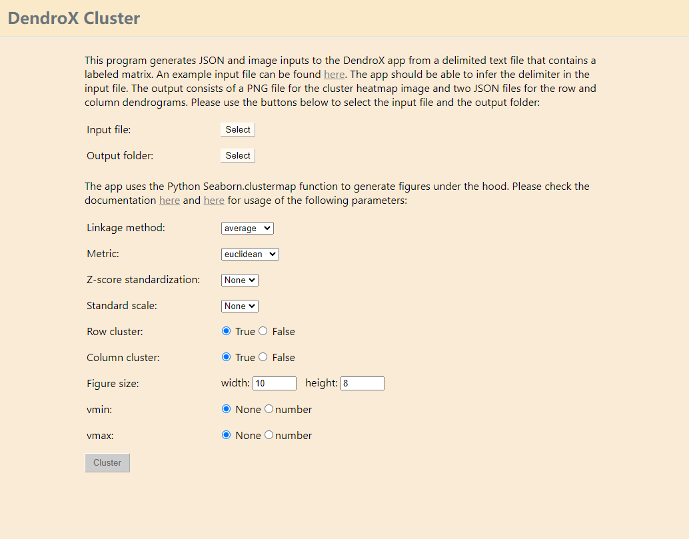

# Dendrox Cluster
This standalone app generates JSON and image inputs to the DendroX app from a delimited text file that contains a labeled matrix. An [example input file](https://github.com/frlender/denrox-cluster/tree/main/example_input) can be found here.

**Please download the MAC and Windows executables using the following links:**
\
[Windows version](https://github.com/frlender/denrox-cluster/blob/main/dist/Dendro_Cluster.exe)
\
[MAC version]()

